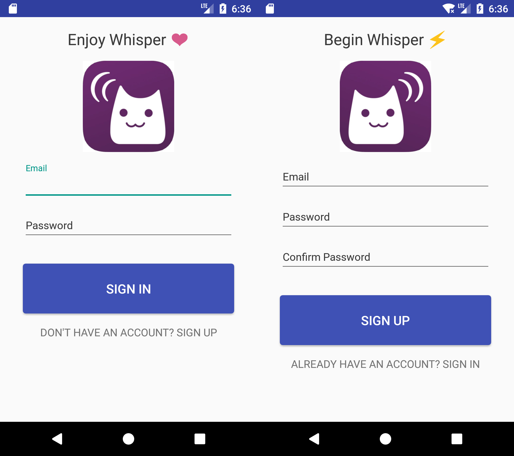
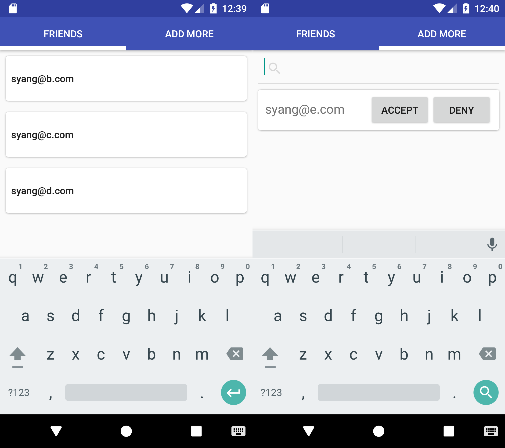
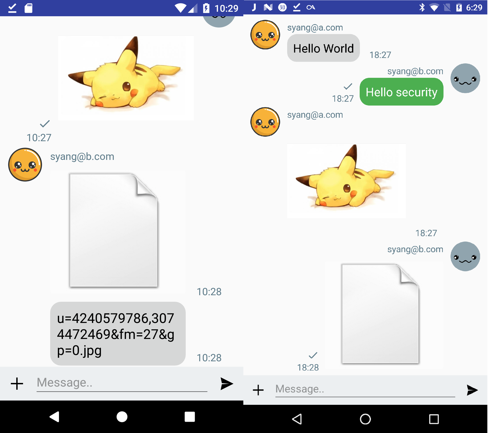
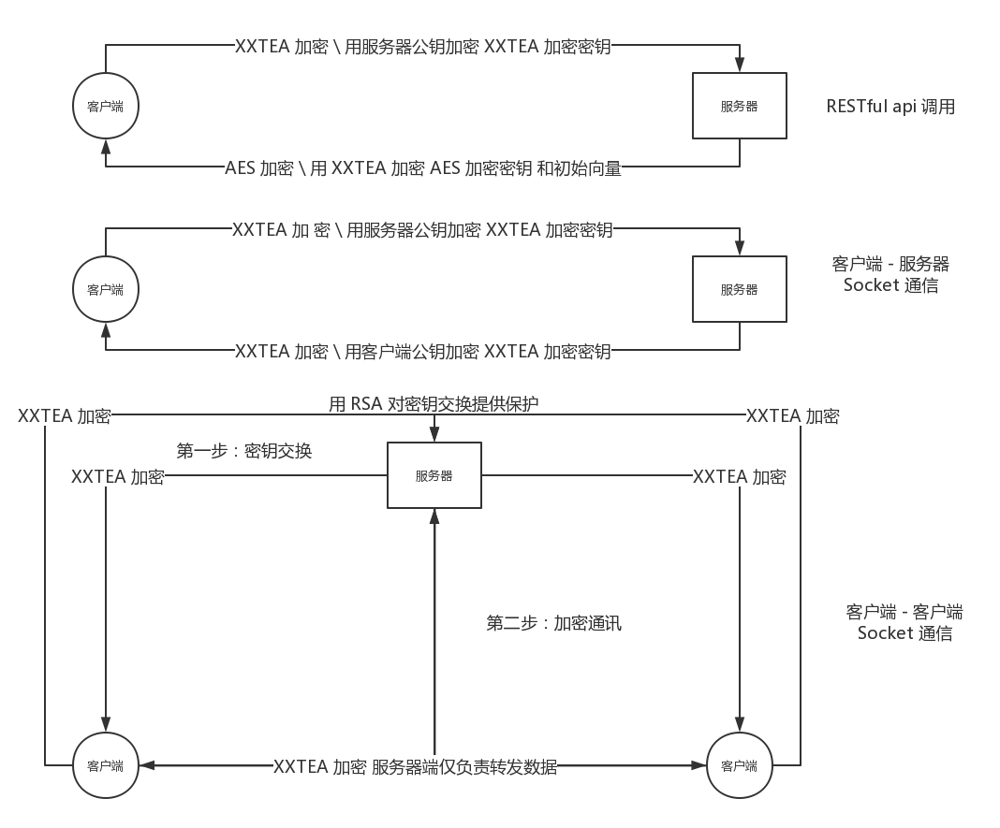
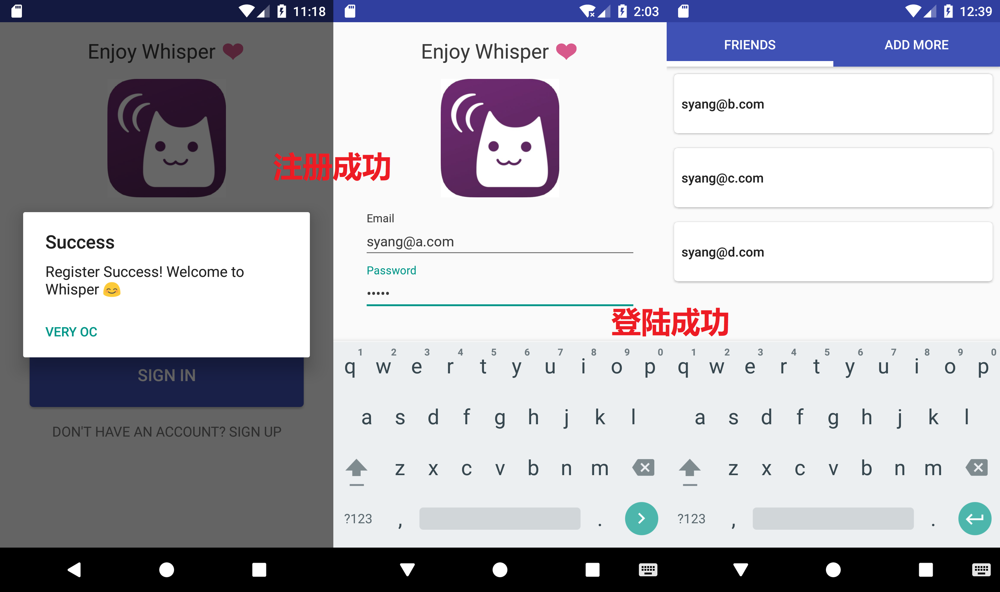
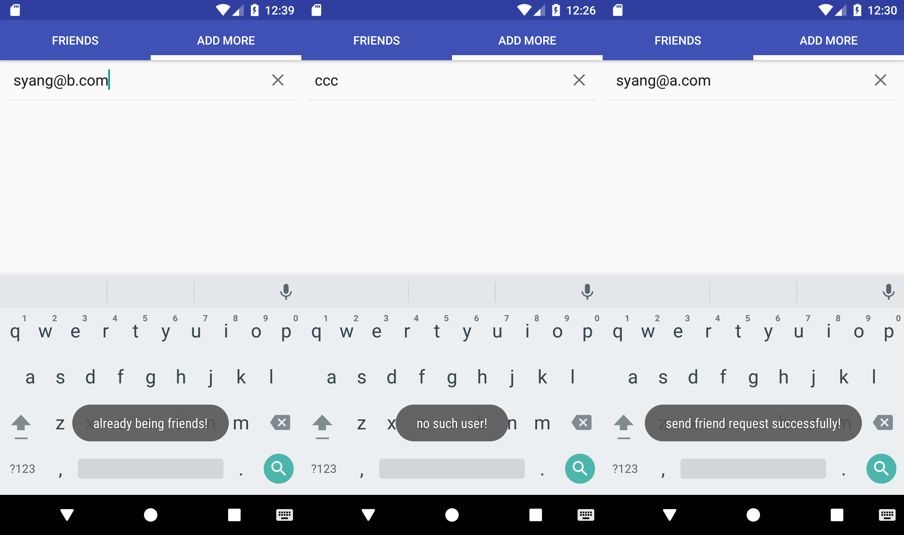
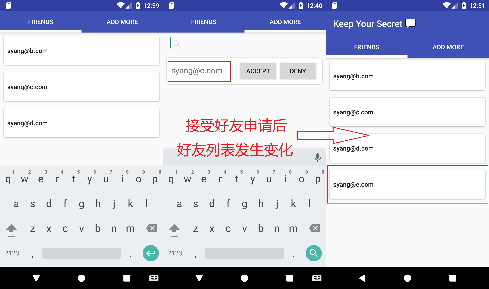
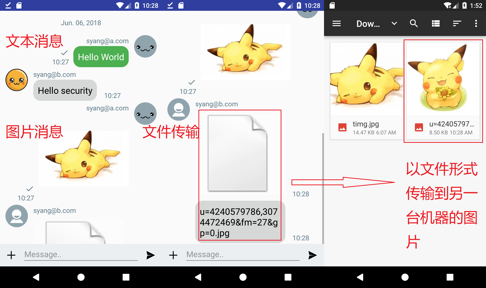

# Whisper - 加密通讯软件 - 设计实现文档

Whisper 是一款基于 Android 和 Node.js 开发的加密通讯软件

Android 作为前端界面，负责提供用户可见的视图以及聊天消息的解密和呈现

Node.js 开发的后台应用则负责密钥分发、业务处理、加密消息的转发

## 程序界面

### 登录 \ 注册 界面

### 好友 \ 添加 界面

### 聊天界面

## 加密机制设计

### 密钥分发机制

1. 服务器有一对公私密钥，其中私钥在服务器平台上保存，公钥预置到所有 Android 应用内部
2. 每一个用户有一对独立的公私钥，其中公钥对所有用户可见，私钥仅用户自身能获得
3. 当用户注册时，服务器端会向权威机构（服务端的一个组件）申请一对公私钥并分配给用户

### 数据库加密机制

1. 用户私钥在数据库中以加密形式存储，加密算法为 XXTEA，加密密钥为用户密码
2. 数据库并不明文存储用户密码，存储的是用户密码加盐后的 hash 值

### 客户端-服务器通讯加密

客户端-服务器的加密通讯有两种类型，一种是 RESTful api 类型，一种是 Socket 类型，两种类型的加密通讯过程相似但不相同

RESTful api 类型的通讯加密过程如下：

1. 客户端生成长度为 32 的随机字符串作为密钥 `key1`，并用 XXTEA 算法加密请求内容，然后使用服务器的 RSA 公钥加密 XXTEA 所使用的密钥 `key1`，然后将这两部分发送给服务器
2. 服务器使用自己的 RSA 私钥解密获得 XXTEA 使用的密钥，然后解密获得具体的请求内容
3. 服务器完成逻辑处理，得到待返回的数据
4. 服务器取 XXTEA 的密钥 `key1` 的前半部分生成 AES 加密需要的密钥 `key2` 以及 初始化向量 `IV`，然后使用 AES 加密返回内容；AES 加密过程中所使用的 `key2` 和 `IV` 通过之前的密钥 `key1` 使用 XXTEA 进行加密
5. 客户端使用本地已有的密钥 `key1` 解密得到 `key2` 和 `IV`，继而通过 AES 算法得到返回内容

Socket 类型的通讯加密过程如下：

1. 客户端生成长度为 32 的随机字符串作为密钥 `key1`，并用 XXTEA 算法加密请求内容，然后使用服务器的 RSA 公钥加密 XXTEA 所使用的密钥 `key1`，然后将这两部分发送给服务器
2. 服务器使用自己的 RSA 私钥解密获得 XXTEA 使用的密钥，然后解密获得具体的请求内容
3. 服务器完成逻辑处理，得到待返回的数据
4. 服务器生成长度为 32 的随机字符串作为密钥 `key2`，并用 XXTEA 算法加密请求内容，然后使用客户端对应的 RSA 公钥加密 XXTEA 所使用的密钥 `key2`，然后将这两部分发送给客户端
5. 客户端通过自己的 RSA 私钥解密得到密钥 `key2`，然后使用 `key2` 解密得到返回内容

### 客户端-客户端通讯加密

客户端间的加密通讯主要使用了 RSA 算法和 XXTEA 算法，有以下两个步骤，加密算法的密钥交换、聊天信息的加密

密钥交换步骤如下：

1. 客户端 A 生成长度为 16 的随机字符串作为密钥的前半部分 `key1`，连同想要通讯的另一个客户端 B 的信息，发送给服务器
2. 服务器解密提取出客户端 B 的信息，然后将密钥 `key1` 发送给客户端 B
3. 客户端 B 解密后得到密钥 `key1`，然后生成长度为 16 的随机字符串 `key2` 并将 `key2` 发送给服务器，此时客户端 B 获得 A B 间的通讯密钥 `key = key1 + key2`
4. 服务器将客户端 B 发送的密钥 `key2` 再次发送给客户端 A，A 解密后得到密钥 `key2`，此时客户端 A 也同样获得了密钥 `key = key1 + key2`

聊天信息加密的步骤如下：

1. 客户端使用 `SHA-256` 算法计算消息的 hash 值后用自己的私钥加密进行签名
2. 客户端使用前一步约定的密钥 `key` 加密消息和消息的 hash 值
3. 用户将需要消息的接收方通过 `客户端-服务器通讯加密` 的方式加密，并将相应加密信息发送给服务器
4. 服务器解密获得接收方的信息，并直接把加密消息和消息的发送方转发给接收方
5. 接收方使用上一步约定的密钥 `key` 解密消息，并使用 `SHA-256` 算法计算相应消息的 hash 值
6. 接收方解密发送方发送的 hash 值并验证签名的有效性和 hash 的有效性

### 架构图

## 加密算法

### AES

[AES](https://en.wikipedia.org/wiki/Advanced_Encryption_Standard) 是最流行的对称加密算法之一，我们在项目中主要使用了 `aes-cbc-128` 作为 AES 加密的具体类型。

项目中有一个部分使用了 AES 加密：

- RESTful api 返回内容加密 

### RSA

[RSA](https://en.wikipedia.org/wiki/RSA_(cryptosystem)) 是目前最有影响力的公钥加密算法，项目中使用的填充方式是 **PKCS1padding**

项目中主要有三部分使用了 RSA 算法：

- RESTful api 的密钥加密
- Client-Server Socket 通讯的密钥加密
- Client-Client Socket 通讯的内容签名

### XXTEA

[XXTEA](https://en.wikipedia.org/wiki/XXTEA) 是一种分组加密算法，是微型加密算法（TEA）的最新变种，目前还没有有效的攻击方法。由于该算法非常快速且安全性有足够保障，所以是项目中主要使用的加密算法。

项目中主要有四部分使用了 XXTEA 算法：

- 用户私钥的加密存储

- RESTful api 的参数加密
- Client-Server Socket 通讯的内容加密
- Client-Client Socket 通讯的内容加密

## 前端框架

### 开源组件

- [Apache Commons Lang](https://github.com/apache/commons-lang) : A package of Java utility classes
- [ChatMessageView](https://github.com/bassaer/ChatMessageView) : A chat UI view for Android
- [OkHttp](https://github.com/square/okhttp) : An HTTP & HTTP/2 client for Android and Java applications
- [Socket.IO-client Java](https://github.com/socketio/socket.io-client-java) : Socket.IO v1.x Client Library for Java
- [XXTEA for Java](https://github.com/xxtea/xxtea-java) : A XXTEA library for Java

### 文件结构

* `activity` Activity 目录
* `adapter` Adapter 目录
* `fragment` Fragment 目录
* `model`  对象封装文件夹
* `request` 网络请求封装目录
  * `Restful.java` RESTful 请求封装
  * `SecureCallback.java` 回调函数封装
  * `SecureSocket.java` Socket 通信封装
* `security` 加密算法封装目录
* `utils` 工具类封装目录
  * `FileUtil.java` 文件辅助类
  * `RSAUtil.java` RSA 转换辅助类
* `WhisperApplication.java` Application 类，全局变量、方法配置

## 后端框架

### 技术架构

基于 Node.js 使用 Koa2 作为 Web 服务框架，通过中间件的方式添加各种扩展，如数据库、RESTful 服务、socket.io 等。

### 文件结构

* `assets` 静态文件目录
* `controllers` 控制器目录
  * `api.js` RESTful API 业务逻辑
* `crypto` 加密算法目录
* `models` 数据库模型定义目录
* `utils` 工具类目录
* `app.js` Koa 应用启动文件
* `controller.js` 扫描并注册控制器
* `db.js` 定义数据库模型规范
* `db.sql` 数据库定义文件
* `model.js` 扫描并导入数据库模型
* `package.json` npm 配置文件
* `rest.js` 支持 REST 的 Koa 中间件
* `socket.js` Socket.IO 事件处理逻辑
* `yarn.lock` yarn 配置文件

## 运行流程

### 登录注册

用户首先需要用邮箱注册，如果注册成功则用户跳转到登录界面进行登录，如果注册失败则提示错误信息

### 查找 \ 添加好友

当用户发出查找好友的请求时，服务器会根据用户请求来查找是否有该用户存在，并向客户端返回相应消息

于此同时，被添加的一方会收到相应的好友请求，用户可以选择接受或拒绝好友请求

### 好友通信

好友间可以进行通信，可以发送的有三种类型的数据：`文本` \ `文件` \ `图片`

其中 `文本` \ `图片` 会直接显示在用户聊天窗口，`文件` 则会存储到用户 SD 卡的 `Download` 目录下

